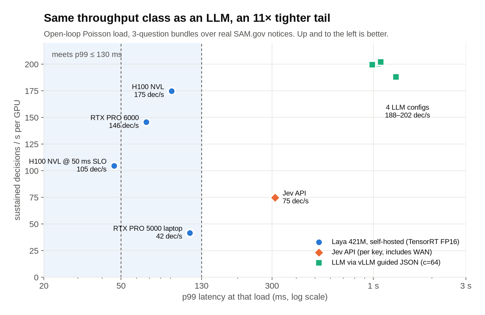
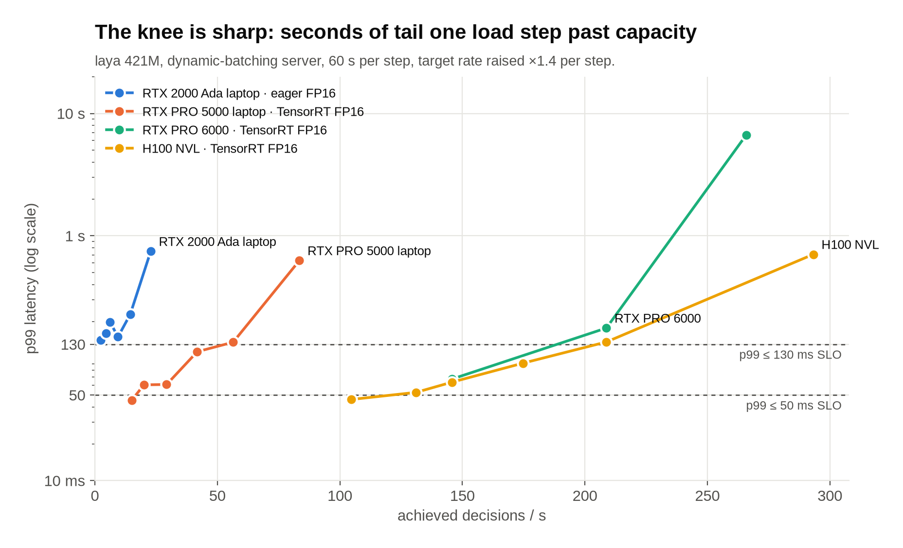
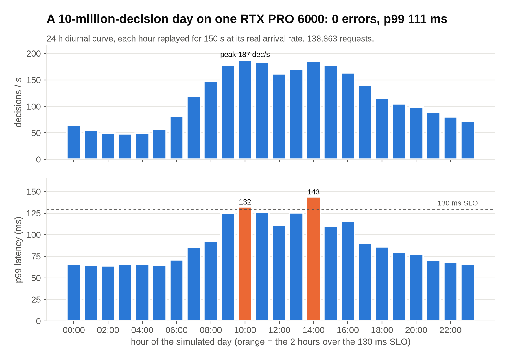
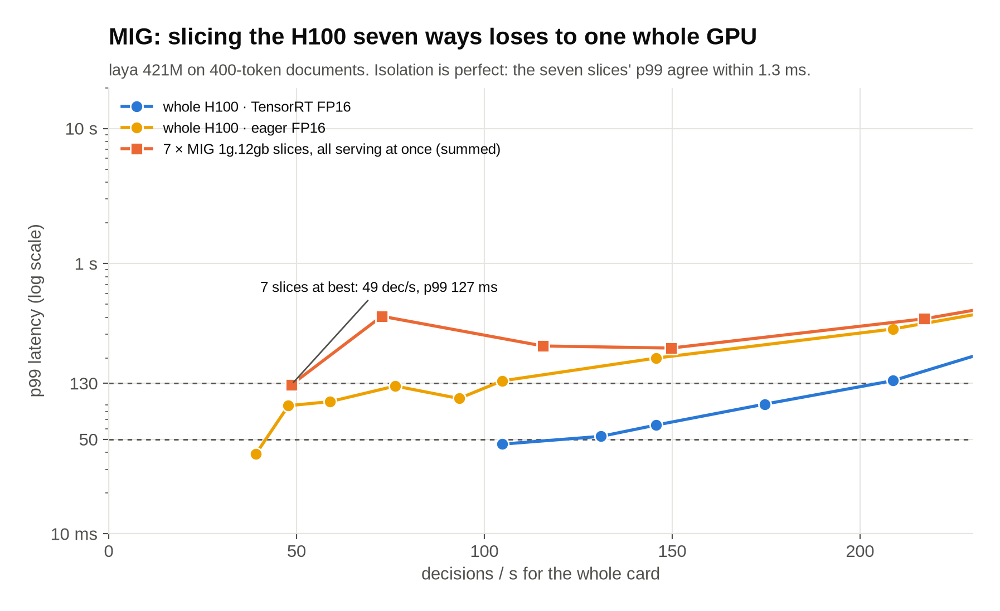
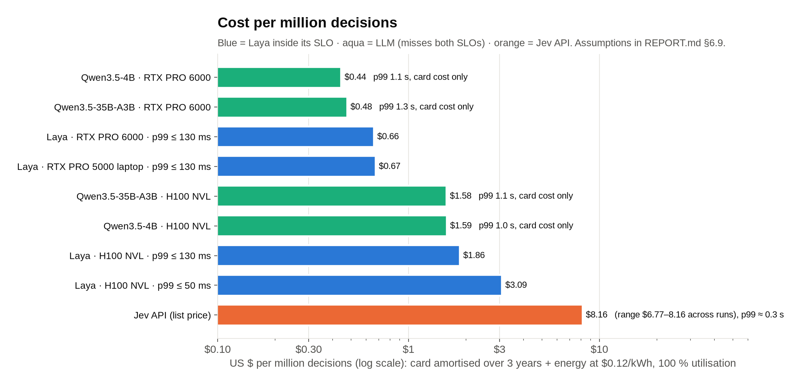
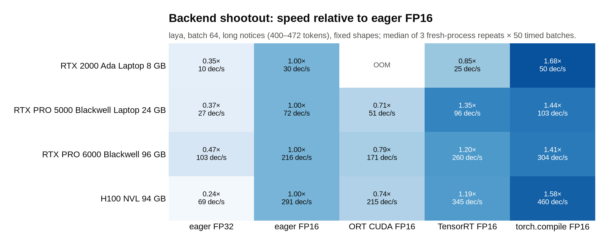
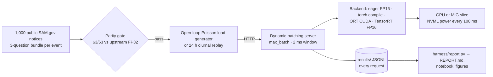

# laya-cuda-bench

**How many typed decisions per second can one NVIDIA GPU serve under a p99 latency SLO, and what does each
million cost?** An open, reproducible capacity-planning study of [Laya](https://github.com/NandhaKishorM/laya),
Convai's open-weights "System 1" decision models (421M English / 322M multilingual), across four GPUs, five
inference backends, MIG slicing, a hosted API and two LLM baselines.

[](LICENSE)


<picture>
  <source media="(prefers-color-scheme: dark)" srcset="docs/figures/hero-dark.png">
  
</picture>

## Key findings

| | |
|---|---|
| **10M decisions in a day on one card** | A 24-hour diurnal curve scaled to 10 million decisions, replayed on one RTX PRO 6000 Blackwell: 138,863 requests, **0 errors, overall p99 111 ms**. |
| **15M/day on one H100 inside p99 ≤ 130 ms** | H100 NVL + TensorRT FP16 sustains **175 decisions/s at p99 ≤ 130 ms** and **105 at p99 ≤ 50 ms**. The RTX PRO 6000 is within 20 % (146/s) at 28 % of the price. |
| **LLMs match the throughput but not the tail** | Qwen3.5-35B-A3B-FP8 and Qwen3.5-4B via vLLM guided JSON reach ~200 decisions/s per card with **p99 ≈ 1 s**. They never meet either SLO. |
| **$0.66 per million decisions** | Self-hosted on a Blackwell card at the 130 ms SLO, versus **$6.8–8.2/M** for the hosted Jev API at list price. Below ~1M decisions/day the API is cheaper and has no ops. |
| **MIG is the wrong shape for documents** | 7 × 1g.12gb slices lose to the whole H100 by 2–3.5× on 400-token inputs, although isolation is perfect (the slices agree within ~1 ms). |
| **Fidelity first** | Every backend and precision (eager FP32/FP16/BF16, `torch.compile`, ONNX Runtime CUDA, TensorRT) reproduces upstream's answers **63/63** on every GPU: 74 of 74 parity runs. |

Full study, with every table traced to the file that backs it: **[REPORT.md](REPORT.md)**.

## Capacity under SLO, whole GPUs, natural SAM.gov length mix (`laya`)

| GPU | p99 ≤ 50 ms | p99 ≤ 130 ms | offline ceiling (no SLO) | $/M decisions at 130 ms |
|---|---|---|---|---|
| RTX 2000 Ada Laptop 8 GB (45 W) | not met | not met (multilingual: 5 dec/s) | 39 dec/s | — |
| RTX PRO 5000 Blackwell Laptop 24 GB | 15 dec/s = 1.3M/day | 42 dec/s = 3.6M/day | 85 dec/s | $0.67 |
| RTX PRO 6000 Blackwell 96 GB | not measured¹ | 146 dec/s = 12.6M/day | 273 dec/s | $0.66 |
| H100 NVL 94 GB, TensorRT | **105 dec/s = 9.0M/day** | **175 dec/s = 15.1M/day** | 339 dec/s | $1.86 |
| 7 × MIG 1g.12gb on the H100 | not met | not met (best: 49 dec/s at p99 127 ms) | — | — |

¹ Sweep predates the harness's downward search; listed as a follow-up in [REPORT.md §11](REPORT.md#11-gaps-and-follow-ups-ordered-by-value).
Cost = card amortised over 3 years at 100 % utilisation + energy at $0.12/kWh (assumptions in [§6.9](REPORT.md#69-cost-per-million-decisions)).

## Figures

Every figure is drawn from the committed `results/` by [`scripts/make_figures.py`](scripts/make_figures.py), which
asserts the headline numbers against this README and the report before drawing.

### The knee is sharp
Past capacity, p99 goes from ~100 ms to seconds within one ×1.4 load step, because the batcher fills to `max_batch`
and a batch of long notices becomes a ~1 s forward. Size below the knee, not at "GPU 100 %".

<picture>
  <source media="(prefers-color-scheme: dark)" srcset="docs/figures/knee-dark.png">
  
</picture>

### A large-org day on one workstation card
The two busiest hours (187 and 185 decisions/s) reach 132 and 143 ms. Holding 130 ms at peak needs ~25 % headroom
or a faster backend.

<picture>
  <source media="(prefers-color-scheme: dark)" srcset="docs/figures/day-replay-dark.png">
  
</picture>

### MIG: one whole H100 beats seven slices of it

<picture>
  <source media="(prefers-color-scheme: dark)" srcset="docs/figures/mig-dark.png">
  
</picture>

### Cost per million decisions

<picture>
  <source media="(prefers-color-scheme: dark)" srcset="docs/figures/cost-dark.png">
  
</picture>

### Backend shootout (static shapes)
`torch.compile(mode="max-autotune")` FP16 is the fastest static backend on every card (1.3–1.7× eager FP16 at batch ≥ 64).
Under dynamic-batch serving the winner depends on architecture: **TensorRT on Hopper** (H100: 175 vs 93
decisions/s at p99 ≤ 130 ms), **eager FP16 ties TensorRT on Blackwell** (RTX PRO 6000: 146 vs 146).

<picture>
  <source media="(prefers-color-scheme: dark)" srcset="docs/figures/shootout-dark.png">
  
</picture>

## How it was measured



| Section | Method | Files |
|---|---|---|
| **Parity gate** | 63 questions from the laya-mlx port's parity cases; every backend must match the upstream FP32 answer 63/63 and hold zero steady-state allocator growth over 100 calls | `harness/parity.py`, `results/<box>/parity.json` |
| **Server (headline)** | MLPerf-Server-style: open-loop Poisson arrivals against a dynamic-batching server, target QPS raised geometrically, max sustained decisions/s with **p99 ≤ 50 ms** and **p99 ≤ 130 ms** (MLPerf's retired BERT Server bound) | `harness/server.py`, `harness/loadgen.py`, `harness/sweep.py`, `results/<box>/server/` |
| **Offline** | largest batch that fits, 50 timed batches → decisions/s (comparable to upstream's batched T4 and the port's 50-question M3 Max numbers) | `harness/offline.py` |
| **Large-org day** | a 24 h diurnal curve scaled to 10M decisions/day; each hour is replayed for 150 s at that hour's real arrival rate, so the 1 h run walks the day's shape without inflating the load | `fixtures/workload/diurnal.csv`, `harness/loadgen.py --curve` |
| **Backend shootout** | FP16 eager / `torch.compile` / ONNX Runtime CUDA / ONNX Runtime TensorRT (+ FP32 eager reference), batch {1,16,64,256} × {short,long}, 20 warmup + 50 timed, 3 fresh-process repeats | `harness/shootout.py` |
| **MIG** | H100 NVL: whole GPU vs one 1g.12gb slice vs **7 × 1g.12gb serving at once** (aggregate per card) | `k8s/`, `scripts/h100_window.md` |
| **Baselines** | the hosted Jev API (`api.typesafe.ai`, `jev-1.13.0`, same 3 questions, measured over the network), Qwen3.5-35B-A3B-FP8 and Qwen3.5-4B via vLLM guided JSON on the same GPUs | `harness/jev_probe.py`, `harness/llm_baseline.py` |
| **Cost** | $/M decisions = energy at the SLO operating point + amortised card (3 years); $/M input tokens for the Jev row | `harness/report.py` |

**Workload.** A request is the 3-question bundle an agent fires per event (`route`: choice, 3 options; `severity`:
score, 3 levels; `needs_human`: yes/no), over one of 1,000 public U.S. federal contract-opportunity notices sampled from
SAM.gov's data.gov bulk extract (`fixtures/workload/`, provenance in `source.json`). Length buckets by each
checkpoint's own tokenizer: short ≤ 80, medium 160–360, long 400–472, xlong 700–984 tokens.

**Timing boundary.** Shootout and Offline time prompt construction → tokenization → host-to-device copy → forward →
device-to-host copy (which synchronizes) → temperature calibration → answer formatting; model load is excluded. This
is the boundary laya-mlx's BENCHMARKS.md uses, so those rows are comparable. Server numbers are client-observed
request latency over loopback HTTP, including queueing and batching. Power is board power sampled in-process with
NVML every 100 ms (on a MIG slice this is the whole card).

**Batching.** Upstream `Agent.predict` batches the questions of one state. Here a batch is any set of (state, question)
rows built with the upstream `build_sequence`, so tokens are identical, and the model is called directly
(`harness/sequences.py`), the same way the MLX port produced its 64-batch throughput number.

**Pinned.** Upstream sources, weights (by SHA256) and library versions are in `manifest.json` and
[REPORT.md §2](REPORT.md#2-what-was-pinned); each box's driver, CUDA, clocks and MIG state are in `results/<box>/env.json`.

## Reproduce

```bash
./setup_env.sh .venv python3.12          # torch 2.14 cu130, laya @ pinned commit, ORT 1.30 (CUDA 13 feed), TensorRT 10.16
hf download convaiinnovations/laya --revision c5d78730f3493e4fe16d61507ef4b78eef7318cf --local-dir models/laya
hf download convaiinnovations/laya-multilingual --local-dir models/laya-multilingual
hf download convaiinnovations/laya-typed-decisions --local-dir models/laya-typed-decisions
python scripts/make_manifest.py          # compare the SHA256s with the committed manifest.json
python -m harness.envinfo --box mybox
python -m harness.export_onnx
python -m harness.parity --box mybox --backends eager-fp32 eager-fp16 ort-cuda-fp16 ort-trt-fp16 compile-fp16
python -m harness.shootout --box mybox
python -m harness.sweep --box mybox --model laya --backend eager-fp16
python -m harness.offline --box mybox --model laya --backend eager-fp16
python scripts/make_figures.py           # redraw docs/figures/ from results/
```

`fixtures/workload/make_workload.py` rebuilds the workload from the current SAM.gov extract; the committed
`states.jsonl` is the frozen version used for every number here. `notebooks/report.ipynb` recomputes every table and
chart from `results/` (cost assumptions in its first cell).

## Repository layout

```
harness/     parity, shootout, server + load generator + sweep, offline, baselines, report/cost model
fixtures/    parity cases with upstream expected outputs; the frozen SAM.gov workload and diurnal curve
results/     raw per-request / per-iteration JSONL and per-run JSON for every box (the record)
docs/figures/  README and report figures (regenerate with scripts/make_figures.py)
notebooks/   report.ipynb, all tables and charts from results/
k8s/, scripts/  the per-box run chains and the H100 MIG window checklist
REPORT.md    the full study: method, results, synthesis, dead ends, limitations, follow-ups
```

## Limitations

- Parity on 63 fixtures is fidelity to upstream, not task accuracy. No accuracy claim is made for any model.
- The Jev row is measured over the public internet from Arizona; its latency includes the network.
- MIG power is per physical card; per-slice energy is not measurable with NVML.
- The load generator runs on the same host over loopback; the serving stack is a ~120-line asyncio
  dynamic batcher, not Triton (same algorithm; Triton is a follow-up row).
- LLM baselines report latency/throughput/tokens only; one run per sweep configuration. The full list is in
  [REPORT.md §10](REPORT.md#10-limitations).

## Citation

If you use the numbers, harness or workload, please cite (GitHub's **"Cite this repository"** button reads
[`CITATION.cff`](CITATION.cff)):

```bibtex
@misc{kinge2026layacudabench,
  author       = {Kinge, Bhushan},
  title        = {laya-cuda-bench: Capacity, Tail Latency and Cost of the Laya Decision Models on NVIDIA GPUs},
  year         = {2026},
  howpublished = {\url{https://github.com/bhushankinge/laya-cuda-bench}}
}
```

## License and acknowledgements

Apache-2.0. Built on [NandhaKishorM/laya](https://github.com/NandhaKishorM/laya) and the
[convaiinnovations/laya](https://huggingface.co/convaiinnovations/laya) weights,
[mizorewww/laya-mlx](https://github.com/mizorewww/laya-mlx) (parity fixtures and timing boundary) and
[receptron/laya](https://github.com/receptron/laya) (ONNX export reference). Workload text: public SAM.gov notices.
Full attributions in [`NOTICE`](NOTICE).
